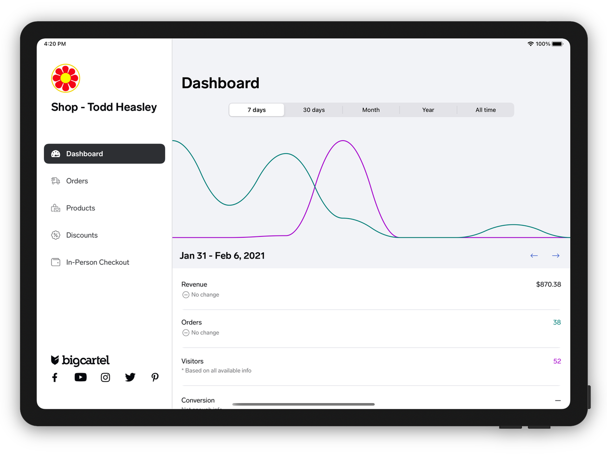
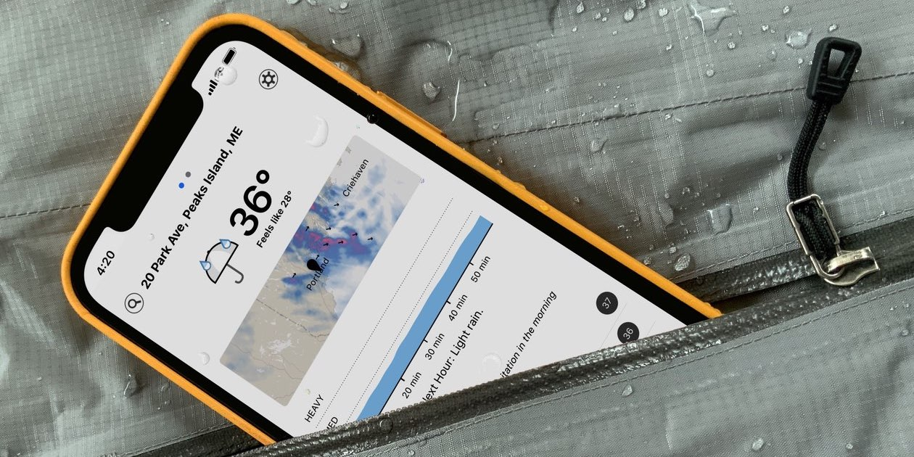
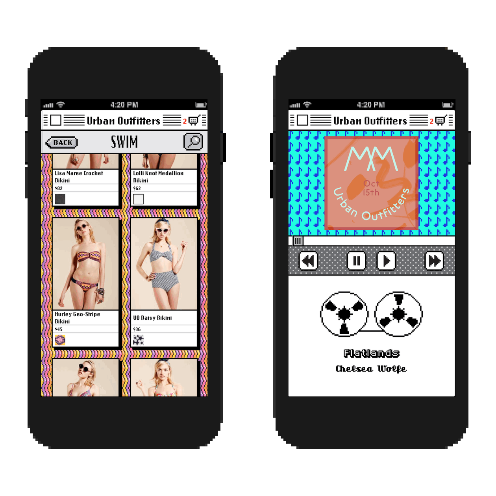

# Todd Heasley

[+1 (610) 996-3333](tel:16109963333)  
[toddheasley@me.com](mailto:toddheasley@me.com)  
[@toddheasley](https://github.com/toddheasley)

## Work

__Mobile Director, [Hodinkee](https://www.hodinkee.com)__  
New York, NY `Remote`  
_November 2021—_

Watch this space.

-----

__Software Engineer, [Big Cartel](https://bigcartel.com)__  
Salt Lake City, UT `Remote`  
_June 2019-August 2021_

Rebuilt [Big Cartel iOS](https://apps.apple.com/app/id739285899) for speed and ease of use:

* Drafts/versioning for products and themes, enabling incremental, anxiety-free editing
* Restored native user interface, replacing Turbolinks with a modern mix of UIKit and SwiftUI
* Baked-in support for VoiceOver and Dynamic Type
* Package-based architecture cleanly separates the app into maintainable libraries
* All powered by GraphQL and Swift Combine

-----

__iOS Developer, [Dark Sky](https://darksky.net)__  
Cambridge, MA `Remote`  
_May 2017-December 2018_

Redesigned [my favorite weather app](https://apps.apple.com/app/id517329357) from the ground up:

* Unified design language across iOS, Android and web
* Programmatically composable weather iconography by [Iconfactory](https://iconfactory.com)
* Modular, framework-based Swift architecture
* Swift interoperability with shared C++ frameworks
* Streamlined deployment workflow and automated testing 

-----

__iOS Developer, [Big Cartel](https://bigcartel.com)__  
Salt Lake City, UT `Remote`  
_October 2013-April 2017_

Launched and grew [Big Cartel iOS](https://apps.apple.com/app/id739285899) into a fully featured admin interface for online shops, including:

* Integration with both Stripe and Square for accepting in-person credit card and contactless payments
* Universal iPhone/iPad support via adaptive layout and size classes
* Seamless transition from Objective-C to Swift between major versions 2 and 3

[Spoke at Seattle Xcoders](https://vimeo.com/98087711) about the design process at Big Cartel.

-----

__Senior Mobile Developer, [Urban Outfitters](https://urbanoutfitters.com)__  
Philadelphia, PA  
_May 2008-September 2013_

Developed and launched the first two major versions of [UO's iPhone app](https://apps.apple.com/app/id358821736), which included:

* Completely native shopping and checkout experience
* UO Radio, a bespoke iTunes-based streaming music service
* Push notifications delivered by a from-scratch APNs provider
* Direct-to-device iTunes music downloads

Led development of the first unified, responsive version of [urbanoutfitters.com](https://urbanoutfitters.com), including:

* Overhaul of the existing Java-based commerce platform
* Page-fragment caching, allowing ~90% of every single page to be served via CDN
* Lightweight responsive HTML and CSS
* Progressive approach to JavaScript enhancement

Assembled and mentored a development team, setting coding standards, refining development/testing/deployment workflows, reviewing code and guiding application design decisions.

-----

__Web Developer, [Free Library of Philadelphia](https://freelibrary.org)__  
Philadelphia, PA  
_June 2007-May 2008_

Working in digital collections, developed and launched the [Free Library Podcast](https://libwww.freelibrary.org/podcast), including:

* Workflow for digitizing, editing and compressing audio and video
* Content management system and RSS feeds

-----

__Web Editor, [AOL](https://aol.com)__  
Santa Monica, CA and New York, NY `Remote`  
_June 2003-March 2007_

Designed, wrote and coded web pages for an assortment of AOL content channels.

-----

__Contract Photo Editor, [AOL](https://aol.com)__  
Philadelphia, PA  
_February 2002-February 2003_

Made my first app, a web-based tool for managing and optimizing web graphics and generating animated GIFs.

-----

__Web Developer, Threshold Entertainment__  
Santa Monica, CA  
_January 2001-September 2001_

Designed and coded sites for [Ozzy Osbourne](https://ozzy.com) and [Ozzfest.](https://ozzfest.com)

## College

__BA Integrative Arts, [Pennsylvania State University](https://psu.edu)__  
_June 1996-December 2000_
